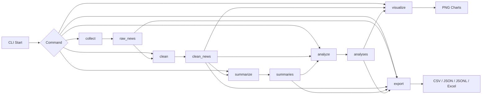
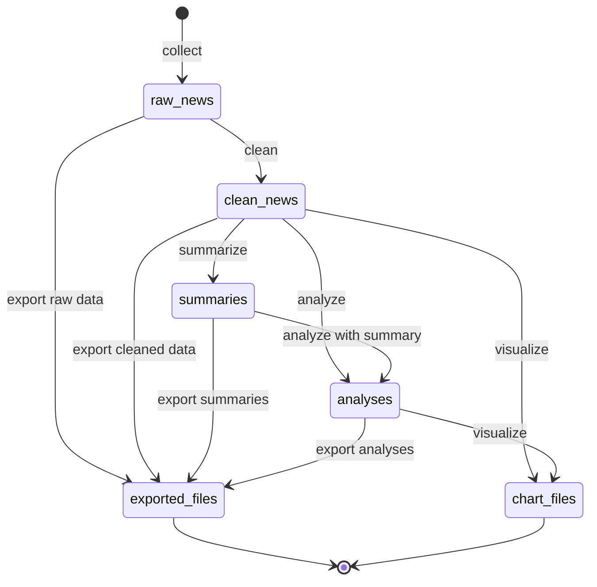

# CLI 기반 AI 뉴스 수집·분석 앱

이 프로젝트는 학습용 Python CLI 애플리케이션입니다. 웹 UI는 없으며, 모든 기능은 PowerShell 같은 터미널에서 `python main.py ...` 명령으로 실행합니다.

뉴스를 RSS 방식과 크롤링 방식으로 수집하고, 원본(raw) 데이터와 정제(clean) 데이터를 SQLite에 분리 저장합니다. 이후 Gemini AI를 이용해 뉴스 요약과 인사이트 분석을 수행하고, matplotlib 차트와 리포트, 파일 내보내기를 생성합니다.

현재 코드 기준 내보내기 포맷은 `csv`, `json`, `jsonl`, `excel`입니다.

## 주요 기능

| 명령어 | 설명 |
| --- | --- |
| `init-db` | SQLite DB와 필요한 테이블을 준비합니다. |
| `fetch` | RSS/API 또는 크롤링 방식으로 뉴스를 수집해 `raw_news`에 저장합니다. |
| `clean` | 원본 뉴스를 정제해 `clean_news`에 저장합니다. |
| `summarize` | Gemini API로 정제 뉴스 요약을 생성해 `summaries`에 저장합니다. |
| `analyze` | 여러 뉴스를 종합해 AI 인사이트를 생성해 `analyses`에 저장합니다. |
| `report` | 품질 지표, TOP N 집계, 최신 분석 결과, 차트 경로가 포함된 리포트를 생성합니다. |
| `export` | DB 데이터를 CSV, JSON, JSONL, Excel 파일로 내보냅니다. |
| `list` | 정제 뉴스 목록을 필터와 페이지네이션으로 조회합니다. |
| `show` | 정제 뉴스 1건과 요약 내용을 상세 조회합니다. |

## 폴더 구조

```text
A2-2/
├── main.py
├── config.json
├── requirements.txt
├── .env.example
├── README.md
├── app/
│   ├── cli.py
│   ├── config.py
│   ├── logger.py
│   ├── database.py
│   ├── fetcher.py
│   ├── crawler.py
│   ├── cleaner.py
│   ├── summarizer.py
│   ├── analyzer.py
│   ├── reporter.py
│   ├── visualizer.py
│   └── exporter.py
├── data/
│   ├── news.db
│   ├── charts/
│   ├── reports/
│   └── exports/
└── logs/
    └── app.log
```

현재 주요 실행 흐름은 `app/config.py`와 `app/logger.py`를 사용합니다.

## 설치 방법

Windows PowerShell 기준입니다.

```powershell
python --version
python -m venv .venv
.\.venv\Scripts\Activate.ps1
python -m pip install --upgrade pip
pip install -r requirements.txt
```

필요 패키지는 `requirements.txt`에 있습니다.

```text
beautifulsoup4
feedparser
google-genai
matplotlib
python-dotenv
requests
```

## 환경변수 설정

Gemini API Key는 코드나 `config.json`에 직접 쓰지 않습니다. `.env.example`을 복사해 `.env`를 만들고, 로컬 환경에서만 값을 설정합니다.

```powershell
Copy-Item .env.example .env
```

`.env`에는 `GEMINI_API_KEY` 값을 설정합니다. 실제 키는 GitHub에 올리면 안 됩니다. `.gitignore`에는 `.env`가 포함되어 있습니다.

## config.json 설정

현재 `config.json` 구조는 다음과 같습니다. 실제 API Key 값은 없고, 환경변수명만 들어 있습니다.

```json
{
  "database": {
    "db_path": "data/news.db"
  },
  "news": {
    "sources": [
      "https://news.google.com/rss?hl=ko&gl=KR&ceid=KR:ko"
    ],
    "rss_url": "https://news.google.com/rss?hl=ko&gl=KR&ceid=KR:ko",
    "crawl_url": "https://news.ycombinator.com/news",
    "duplicate_policy": "skip"
  },
  "request": {
    "timeout": 10,
    "delay": 1.0
  },
  "gemini": {
    "api_key_env": "GEMINI_API_KEY",
    "model": "gemini-3.6-flash"
  },
  "paths": {
    "reports_dir": "data/reports",
    "exports_dir": "data/exports",
    "charts_dir": "data/charts",
    "logs_dir": "logs"
  },
  "logging": {
    "level": "INFO",
    "file": "logs/app.log"
  }
}
```

주요 항목:

- `database.db_path`: SQLite DB 파일 경로
- `news.sources`, `news.rss_url`: RSS 뉴스 소스
- `news.crawl_url`: 크롤링 대상 URL
- `news.duplicate_policy`: 중복 처리 기본 정책, `skip` 또는 `upsert`
- `request.timeout`: HTTP 요청 제한 시간
- `request.delay`: 크롤링 요청 간 지연 시간
- `gemini.api_key_env`: API Key를 읽을 환경변수 이름
- `gemini.model`: Gemini 모델명
- `paths.reports_dir`: 리포트 저장 경로
- `paths.exports_dir`: 내보내기 파일 저장 경로
- `paths.charts_dir`: 차트 PNG 저장 경로
- `paths.logs_dir`: 로그 디렉터리
- `logging.level`: 로그 레벨
- `logging.file`: 로그 파일 경로

## DB 초기화

```powershell
python main.py init-db
```

DB 파일이 없으면 `data/news.db`가 생성되고, `raw_news`, `clean_news`, `summaries`, `analyses` 테이블이 준비됩니다. 기존 데이터는 삭제하지 않습니다.

## CLI 사용 예시

전체 도움말:

```powershell
python main.py --help
```

뉴스 수집:

```powershell
python main.py fetch --method rss --limit 10
python main.py fetch --method crawl --limit 5
```

데이터 정제:

```powershell
python main.py clean --policy skip
python main.py clean --policy upsert
```

AI 요약:

```powershell
python main.py summarize --unsummarized --limit 3
python main.py summarize --id 1
```

AI 인사이트 분석:

```powershell
python main.py analyze --date-from 2025-01-01 --date-to 2025-12-31 --category IT
python main.py analyze --limit 20
```

리포트 생성:

```powershell
python main.py report --format md --top-n 5
python main.py report --format txt --top-n 5
```

데이터 내보내기:

```powershell
python main.py export --format csv --status summarized
python main.py export --format json --status summarized
python main.py export --format jsonl --status summarized
python main.py export --format excel --status summarized
python main.py export --format csv --status all
```

뉴스 조회:

```powershell
python main.py list --page 1 --page-size 10
python main.py list --category IT --page 1 --page-size 10
python main.py list --keyword AI --page 1 --page-size 10
python main.py show --id 1
```

## 현재 CLI 옵션 요약

```text
fetch:     --method {rss,api,crawl}, --source, --limit, --category
clean:     --policy {skip,upsert}, --limit
summarize: --all, --id, --unsummarized, --limit
analyze:   --date-from, --date-to, --category, --limit
report:    --format {txt,md}, --top-n
export:    --table {clean_news,summaries,analyses}, --format {csv,json,jsonl,excel}, --status {all,cleaned,summarized}, --summarized, --category, --date-from, --date-to
list:      --category, --date-from, --date-to, --keyword, --page, --page-size
show:      --id
```

## 학습 개념

### RSS/API 방식과 크롤링 방식

RSS/API 방식은 구조화된 피드나 API 응답을 읽기 때문에 비교적 안정적입니다. 크롤링 방식은 HTML 페이지를 직접 읽고 필요한 링크나 텍스트를 추출하므로 사이트 구조 변경에 영향을 받기 쉽습니다.

### HTTP timeout과 오류 처리

외부 요청은 네트워크 문제로 멈출 수 있습니다. `request.timeout`은 요청이 너무 오래 걸릴 때 중단하게 해 주며, 오류가 발생해도 프로그램 전체가 비정상 종료되지 않도록 로그를 남기고 다음 작업으로 넘어갑니다.

### raw 데이터와 clean 데이터 분리

`raw_news`는 수집 당시의 원본 정보를 보존합니다. `clean_news`는 제목, URL, 본문, 날짜, 카테고리 등을 정규화한 데이터입니다. 두 저장소를 분리하면 정제 규칙을 바꿔도 원본을 다시 활용할 수 있습니다.

### AI 요약/분석 흐름

정제된 뉴스 본문을 Gemini API에 전달해 요약을 생성하고, 여러 뉴스의 제목·본문·요약을 묶어 트렌드, 키워드, 시사점 같은 인사이트를 생성합니다. API Key는 `.env`의 환경변수로만 읽습니다.

### SQLite를 사용하는 이유

SQLite는 별도 서버 없이 파일 하나로 데이터를 저장할 수 있어 학습용 CLI 프로젝트에 적합합니다. 이 프로젝트는 `data/news.db`를 영구 저장소로 사용합니다.

### matplotlib 시각화

`report` 명령은 matplotlib으로 카테고리별 뉴스 수와 일자별 수집 추이 차트를 PNG 파일로 생성합니다.

### CSV/JSONL/Excel export 차이

CSV는 표 형태 데이터를 엑셀이나 스프레드시트에서 열기 쉽습니다. JSONL은 한 줄에 JSON 객체 하나를 저장하는 로그/데이터 처리 친화 형식입니다. Excel은 서식 있는 스프레드시트 파일입니다. 현재 코드에서 지원하는 포맷은 CSV, JSON, JSONL, Excel입니다.

## 리포트와 차트

리포트 생성:

```powershell
python main.py report --format md --top-n 5
python main.py report --format txt --top-n 5
```

저장 위치:

- 리포트: `data/reports/`
- 차트 PNG: `data/charts/`

생성되는 차트:

- 카테고리별 뉴스 수 차트
- 일자별 수집 추이 차트

리포트에는 총 뉴스 수, 요약 완료 수, 요약 완료 비율, 평균 본문 길이, 카테고리/소스 TOP N, 최신 AI 분석 결과, 생성된 차트 경로가 포함됩니다.

## 로그 확인

로그 파일은 `logs/app.log`에 저장됩니다. 오류가 발생하면 먼저 이 파일을 확인합니다.

```powershell
Get-Content .\logs\app.log -Encoding UTF8 -Tail 30
```

로그에는 시간, 레벨, 모듈명, 메시지가 기록됩니다.

## 정기 실행 예시

Windows에서는 작업 스케줄러를 사용해 주기적으로 명령을 실행할 수 있습니다. 예를 들어 매일 뉴스 수집을 예약할 때 실행 프로그램은 가상환경의 Python, 인수는 `main.py fetch --method rss --limit 20` 형태로 지정할 수 있습니다.

수동 실행 예:

```powershell
python main.py fetch --method rss --limit 20
python main.py clean --policy skip
```

Linux/macOS cron 개념 예:

```bash
0 9 * * * cd /path/to/A2-2 && /path/to/.venv/bin/python main.py fetch --method rss --limit 20
```

## 보안 주의사항

- `.env`를 GitHub에 올리지 마세요.
- API Key를 코드에 직접 작성하지 마세요.
- `config.json`에는 API Key 값이 아니라 환경변수명만 작성하세요.
- 크롤링 시 대상 사이트의 `robots.txt`와 이용 정책을 확인하세요.
- 과도한 요청을 보내지 마세요.
- `request.delay`를 사용해 요청 간 지연을 두는 것을 권장합니다.

## 문제 해결

### ModuleNotFoundError

패키지가 설치되지 않은 상태입니다.

```powershell
pip install -r requirements.txt
```

### Gemini API Key 오류

`.env`에 `GEMINI_API_KEY`가 설정되어 있는지 확인하세요. 실제 키를 README, 코드, `config.json`에 적지 마세요.

### RSS 네트워크 오류

네트워크 권한, 방화벽, 프록시, 인터넷 연결을 확인하세요. 오류 내용은 `logs/app.log`에 기록됩니다.

### matplotlib 한글 폰트 깨짐

Windows에서는 기본적으로 `Malgun Gothic`을 사용하도록 설정되어 있습니다. 그래도 깨지면 Windows 한글 폰트 설치 상태를 확인하세요.

### DB 파일이 없을 때

```powershell
python main.py init-db
```

### 오류 원인 확인

```powershell
Get-Content .\logs\app.log -Encoding UTF8 -Tail 30
```

## 최종 점검 명령어

아래 명령어로 주요 흐름을 점검할 수 있습니다.

```powershell
python main.py --help
python main.py fetch --method rss --limit 10
python main.py clean --policy skip
python main.py summarize --unsummarized --limit 3
python main.py analyze --limit 10
python main.py report --format md
python main.py export --format csv --status summarized
python main.py list --page 1 --page-size 10
python main.py show --id 1
```

Gemini API Key가 없으면 `summarize`와 `analyze`는 실패할 수 있지만, 프로그램이 비정상 종료되지 않고 오류 메시지와 로그를 남기도록 구성되어 있습니다.


---

## System Flow




## System Structure

| Layer | Component | Role |
|---|---|---|
| CLI Layer | `main.py`, `app/cli.py` | 사용자 명령어를 받아 각 기능 실행 |
| Config Layer | `app/config.py`, `.env`, `config.json` | API Key, DB 경로, 설정값 관리 |
| Data Collection | `collect` | RSS 또는 웹 크롤링으로 뉴스 수집 |
| Data Cleaning | `clean` | 중복 제거, 텍스트 정제, 정규화 |
| AI Processing | `summarize`, `analyze` | Gemini API를 이용한 요약 및 분석 |
| Database Layer | `app/database.py` | SQLite 테이블 생성, 저장, 조회 |
| Visualization | `visualize` | matplotlib 기반 PNG 차트 생성 |
| Export | `app/exporter.py` | CSV, JSON, JSONL, Excel 파일 내보내기 |
| Logging | `app/logger.py` | 실행 기록 및 오류 로그 저장 |


## Data State Transition



## Module Role Summary

| Module | Role | Main Responsibility |
|---|---|---|
| `main.py` | Entry Point | Starts the CLI application |
| `app/cli.py` | Command Router | Defines and routes CLI subcommands |
| `app/config.py` | Configuration Manager | Loads `.env`, `config.json`, API keys, and settings |
| `app/database.py` | Database Layer | Creates tables and handles SQLite queries |
| `app/logger.py` | Logging Manager | Records execution logs and errors |
| `collector` / `crawler` | Data Collection | Collects news from RSS or web crawling |
| `cleaner` | Data Cleaning | Normalizes text and removes duplicated or invalid data |
| `summarizer` | AI Summary | Uses Gemini API to summarize cleaned news |
| `analyzer` | AI Analysis | Uses Gemini API to analyze news content |
| `visualizer` | Chart Generator | Generates PNG charts using stored data |
| `app/exporter.py` | Export Manager | Exports data to CSV, JSON, JSONL, and Excel |


| Module | Role |
|---|---|
| `cli.py` | CLI 명령어 라우팅 |
| `config.py` | 설정 및 환경변수 관리 |
| `database.py` | SQLite 저장/조회 |
| `collect` | 뉴스 수집 |
| `clean` | 데이터 정제 |
| `summarize` | Gemini 요약 |
| `analyze` | Gemini 분석 |
| `visualize` | 차트 생성 |
| `exporter.py` | 파일 내보내기 |
| `logger.py` | 로그 기록 |


## Database Table Summary

| Table | Description | Created By | Used By |
|---|---|---|---|
| `raw_news` | Original collected news data | `collect` | `clean`, `export` |
| `clean_news` | Cleaned and normalized news data | `clean` | `summarize`, `analyze`, `visualize`, `export` |
| `summaries` | Gemini-generated summaries | `summarize` | `analyze`, `export` |
| `analyses` | Gemini-generated analysis results | `analyze` | `visualize`, `export` |


## CLI Command Summary

| Command | Input | Output | Purpose |
|---|---|---|---|
| `collect` | RSS URL or crawling target | `raw_news` | Collect raw news articles |
| `clean` | `raw_news` | `clean_news` | Clean and normalize collected news |
| `summarize` | `clean_news` | `summaries` | Generate AI summaries using Gemini |
| `analyze` | `clean_news`, `summaries` | `analyses` | Generate AI-based analysis |
| `visualize` | Database records | PNG chart files | Create visual reports |
| `export` | Database records | CSV, JSON, JSONL, Excel | Export project data |
