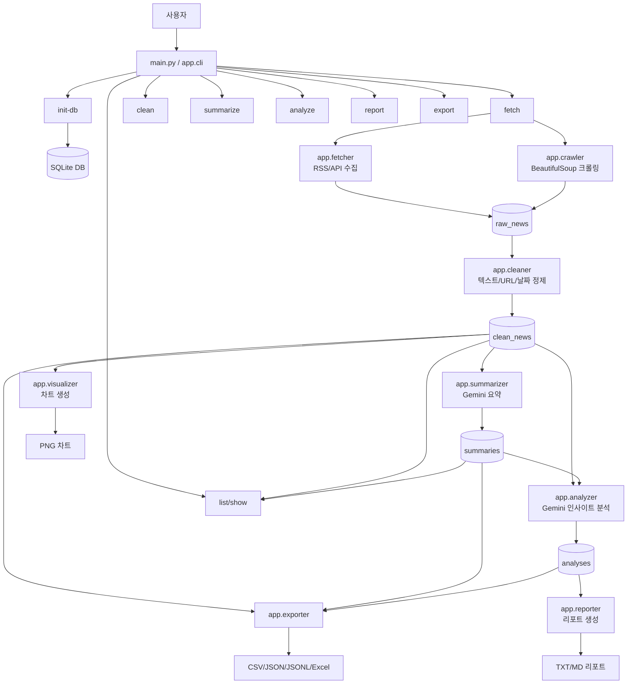
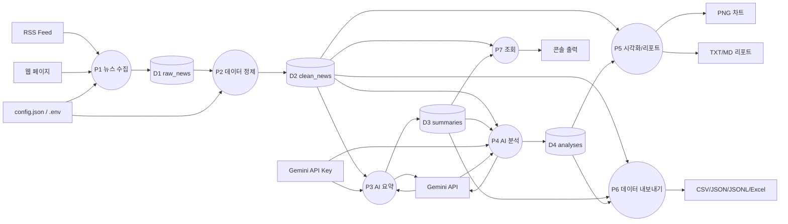
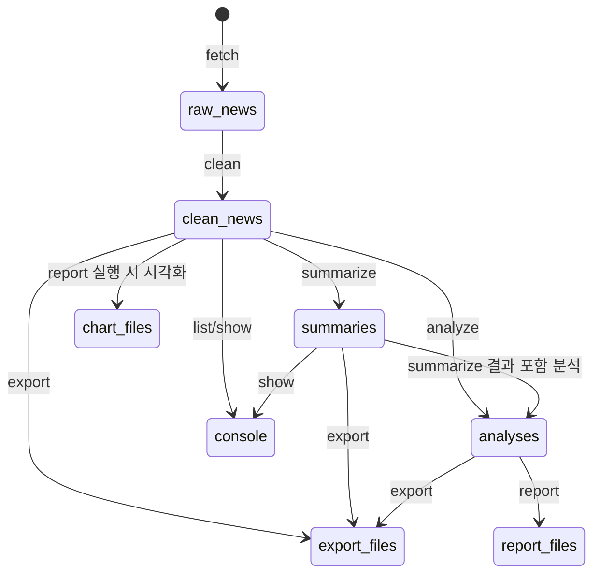
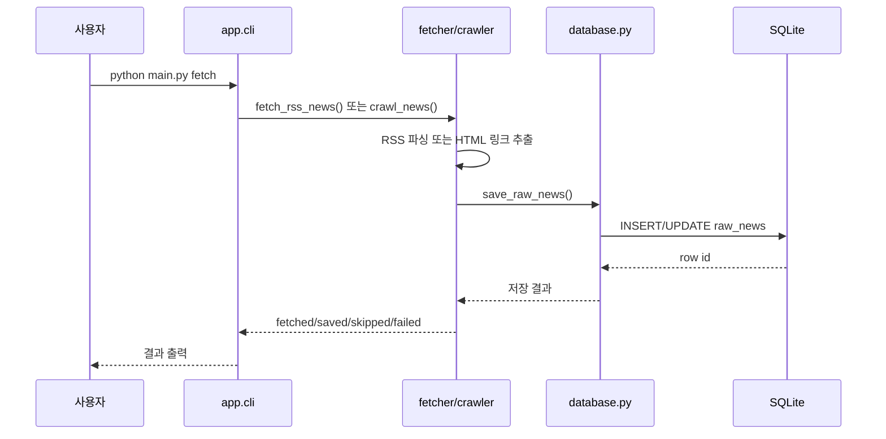
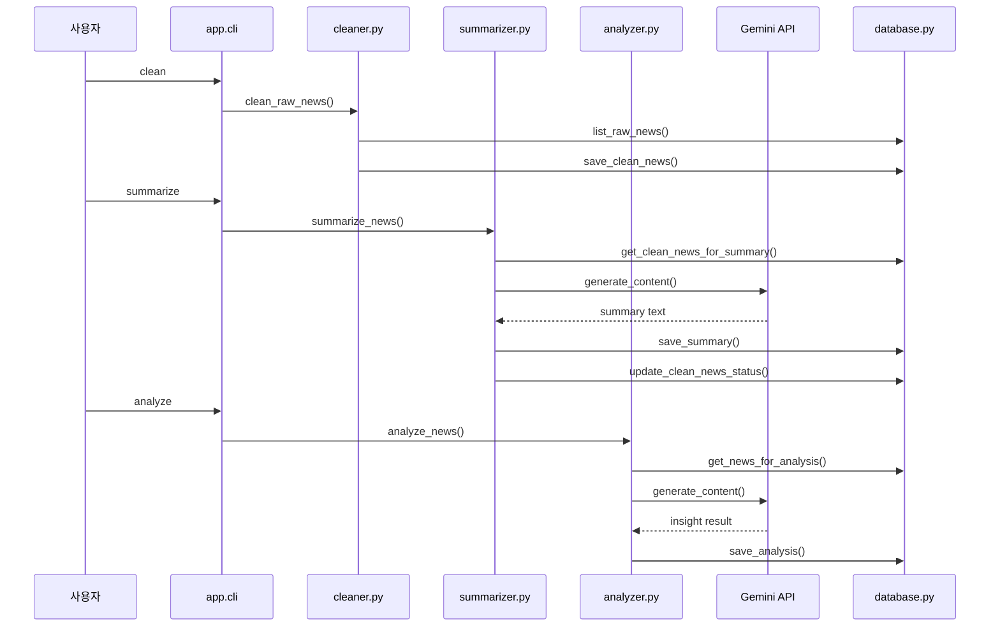
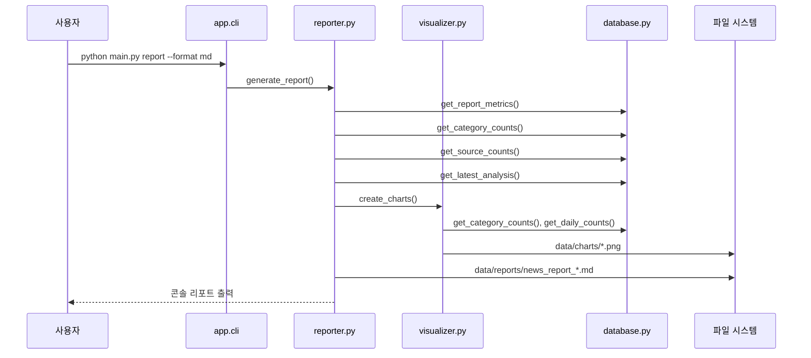

# 사용자 매뉴얼

## 1. 프로젝트 개요

이 프로젝트는 **CLI 기반 AI 뉴스 수집·정제·요약·분석 애플리케이션**입니다. 웹 UI 없이 PowerShell 또는 터미널에서 `python main.py ...` 명령을 실행해 뉴스 데이터를 수집하고, SQLite 데이터베이스에 저장한 뒤, Gemini AI로 요약과 인사이트 분석을 수행합니다.

주요 목적은 다음과 같습니다.

- RSS/API 방식과 크롤링 방식으로 뉴스 수집
- 원본 데이터(`raw_news`)와 정제 데이터(`clean_news`) 분리 저장
- Gemini API 기반 뉴스 요약 및 종합 분석
- matplotlib 기반 차트 생성
- TXT/MD 리포트 생성
- CSV, JSON, JSONL, Excel 파일 export
- CLI 명령을 통한 목록 조회와 상세 조회

## 2. 실행 전 준비

### 2.1 Python 및 패키지 설치

```powershell
python --version
python -m venv .venv
.\.venv\Scripts\Activate.ps1
python -m pip install --upgrade pip
pip install -r requirements.txt
```

필요 패키지는 `requirements.txt`에 정의되어 있습니다.

```text
beautifulsoup4
feedparser
google-genai
matplotlib
openpyxl
pandas
python-dotenv
requests
```

### 2.2 Gemini API Key 설정

`.env.example`을 복사해 `.env`를 만들고 API Key를 설정합니다.

```powershell
Copy-Item .env.example .env
```

`.env` 예시:

```env
GEMINI_API_KEY=your-gemini-api-key-here
GEMINI_MODEL=gemini-3.6-flash
```

주의:

- 실제 API Key는 코드, README, `config.json`에 직접 적지 않습니다.
- `.env`는 `.gitignore`에 포함되어야 합니다.
- API Key가 없으면 `summarize`, `analyze` 명령은 실패 처리되지만 전체 프로그램이 비정상 종료되지는 않습니다.

### 2.3 DB 초기화

```powershell
python main.py init-db
```

이 명령은 `data/news.db` SQLite 파일과 다음 테이블을 준비합니다.

- `raw_news`
- `clean_news`
- `summaries`
- `analyses`

기존 데이터는 삭제하지 않습니다. 테이블이 없을 때만 생성하고, 필요한 컬럼은 추가 migration 방식으로 보정합니다.

## 3. 빠른 사용 순서

처음 사용하는 경우 아래 순서대로 실행하면 됩니다.

```powershell
python main.py init-db
python main.py fetch --method rss --limit 10
python main.py clean --policy skip
python main.py summarize --unsummarized --limit 3
python main.py analyze --limit 10
python main.py report --format md --top-n 5
python main.py export --format csv --status summarized
python main.py list --page 1 --page-size 10
python main.py show --id 1
```

데이터 흐름은 `fetch → clean → summarize/analyze → report/export/list/show` 순서입니다.

## 4. 프로젝트 폴더 구조

```text
A2-2/
├── main.py
├── config.json
├── requirements.txt
├── .env.example
├── README.md
├── USER_MANUAL.md
├── app/
│   ├── __init__.py
│   ├── cli.py
│   ├── config.py
│   ├── logger.py
│   ├── database.py
│   ├── fetcher.py
│   ├── crawler.py
│   ├── cleaner.py
│   ├── summarizer.py
│   ├── analyzer.py
│   ├── visualizer.py
│   ├── reporter.py
│   └── exporter.py
├── data/
│   ├── news.db
│   ├── charts/
│   ├── reports/
│   └── exports/
└── logs/
    └── app.log
```

## 5. 전체 시스템 흐름도



## 6. DFD: 데이터 입출력 관계



## 7. 데이터 상태 전이



## 8. 명령어 사용법

### 8.1 전체 도움말

```powershell
python main.py --help
```

지원 명령:

| 명령 | 역할 |
|---|---|
| `init-db` | SQLite DB와 테이블 초기화 |
| `fetch` | RSS/API 또는 크롤링 방식으로 뉴스 수집 |
| `clean` | 원본 뉴스 정제 후 `clean_news` 저장 |
| `summarize` | Gemini로 뉴스 요약 생성 |
| `analyze` | 여러 뉴스 기반 인사이트 분석 |
| `report` | 통계, 최신 분석, 차트 경로가 포함된 리포트 생성 |
| `export` | DB 데이터를 파일로 내보내기 |
| `list` | 정제 뉴스 목록 조회 |
| `show` | 정제 뉴스 상세 및 요약 조회 |

### 8.2 뉴스 수집: `fetch`

```powershell
python main.py fetch --method rss --limit 10
python main.py fetch --method crawl --limit 5
python main.py fetch --method rss --source "https://news.google.com/rss?hl=ko&gl=KR&ceid=KR:ko" --category IT --limit 20
```

옵션:

| 옵션 | 설명 |
|---|---|
| `--method {rss,api,crawl}` | 수집 방식. `api`는 현재 RSS 방식과 같은 경로로 처리 |
| `--source` | RSS URL 또는 크롤링 URL |
| `--limit` | 수집할 최대 기사 수 |
| `--category` | 저장할 카테고리 라벨 |

내부 흐름:

```text
app.cli._handle_fetch()
 ├─ rss/api  → app.fetcher.fetch_rss_news()
 └─ crawl    → app.crawler.crawl_news()
       ↓
app.database.save_raw_news()
       ↓
raw_news
```

### 8.3 데이터 정제: `clean`

```powershell
python main.py clean --policy skip
python main.py clean --policy upsert --limit 50
```

옵션:

| 옵션 | 설명 |
|---|---|
| `--policy skip` | 같은 URL이 이미 있으면 건너뜀 |
| `--policy upsert` | 같은 URL이 있으면 기존 데이터를 갱신 |
| `--limit` | 정제할 원본 뉴스 수 제한 |

정제 내용:

- 제목, 본문 공백 정리
- HTML 태그 제거
- URL scheme/host 정규화
- 날짜를 ISO 형식으로 변환
- 카테고리가 없으면 기본값 사용
- `content_length` 계산

내부 흐름:

```text
app.cli._handle_clean()
 → app.cleaner.clean_raw_news()
 → app.database.list_raw_news()
 → app.database.save_clean_news()
 → clean_news
```

### 8.4 AI 요약: `summarize`

```powershell
python main.py summarize --unsummarized --limit 3
python main.py summarize --id 1
python main.py summarize --all --limit 10
```

옵션:

| 옵션 | 설명 |
|---|---|
| `--unsummarized` | 아직 요약되지 않은 뉴스만 요약 |
| `--id` | 특정 `clean_news.id`만 요약 |
| `--all` | 이미 요약된 뉴스도 다시 요약 가능 |
| `--limit` | 요약 대상 수 제한 |

동작:

- `clean_news`에서 대상 뉴스를 조회합니다.
- 본문이 너무 짧으면 `skipped_short_content`로 상태를 변경합니다.
- Gemini API 호출 후 `summaries`에 저장합니다.
- 성공 시 `clean_news.status`를 `summarized`로 변경합니다.
- 실패 시 `summary_failed`로 변경하고 로그에 남깁니다.

내부 흐름:

```text
app.cli._handle_summarize()
 → app.summarizer.summarize_news()
 → app.database.get_clean_news_for_summary()
 → Gemini API
 → app.database.save_summary()
 → app.database.update_clean_news_status()
```

### 8.5 AI 인사이트 분석: `analyze`

```powershell
python main.py analyze --limit 10
python main.py analyze --date-from 2025-01-01 --date-to 2025-12-31 --category IT
```

옵션:

| 옵션 | 설명 |
|---|---|
| `--date-from` | 분석 시작일 |
| `--date-to` | 분석 종료일 |
| `--category` | 카테고리 필터 |
| `--limit` | 분석 대상 뉴스 수 제한 |

분석 입력:

- `clean_news.title`
- `clean_news.content`
- `clean_news.category`
- `clean_news.published_at`
- `summaries.summary`

분석 결과는 `analyses` 테이블에 저장됩니다.

### 8.6 리포트 생성: `report`

```powershell
python main.py report --format md --top-n 5
python main.py report --format txt --top-n 5
```

포함 내용:

- 총 뉴스 수
- 요약 완료 뉴스 수
- 요약 완료 비율
- 평균 본문 길이
- 카테고리별 TOP N
- 소스별 TOP N
- 최신 AI 분석 결과
- 생성된 차트 경로

생성 위치:

- 리포트: `data/reports/`
- 차트: `data/charts/`

내부적으로 `report`는 `app.visualizer.create_charts()`를 호출하므로 차트 생성까지 함께 수행합니다.

### 8.7 데이터 내보내기: `export`

```powershell
python main.py export --format csv --status summarized
python main.py export --format json --status summarized
python main.py export --format jsonl --status summarized
python main.py export --format excel --status summarized
python main.py export --table analyses --format json
```

옵션:

| 옵션 | 설명 |
|---|---|
| `--table {clean_news,summaries,analyses}` | 내보낼 테이블 |
| `--format {csv,json,jsonl,excel}` | 파일 형식 |
| `--status {all,cleaned,summarized}` | 상태 필터 |
| `--summarized` | 요약된 뉴스만 export |
| `--category` | 카테고리 필터 |
| `--date-from` | 시작일 필터 |
| `--date-to` | 종료일 필터 |

생성 위치:

```text
data/exports/
```

### 8.8 목록 조회: `list`

```powershell
python main.py list --page 1 --page-size 10
python main.py list --category IT --keyword AI --page 1 --page-size 10
python main.py list --date-from 2025-01-01 --date-to 2025-12-31
```

출력 항목:

- ID
- 게시일
- 카테고리
- 제목
- 처리 상태
- 요약 여부

### 8.9 상세 조회: `show`

```powershell
python main.py show --id 1
```

출력 항목:

- 제목
- URL
- 소스
- 카테고리
- 게시일
- 처리 상태
- 본문 길이
- 본문
- 요약문

## 9. 모듈별 책임

| 모듈 | 주요 책임 | 주요 입출력 |
|---|---|---|
| `main.py` | 애플리케이션 진입점, 전체 예외 로깅 | CLI 실행 |
| `app/cli.py` | argparse 명령 정의 및 핸들러 라우팅 | 사용자 명령 → 기능 모듈 호출 |
| `app/config.py` | `config.json`, `.env`, 기본 설정 병합 | 설정 dict |
| `app/logger.py` | 콘솔/파일 로깅 설정 | `logs/app.log` |
| `app/database.py` | SQLite 연결, 테이블 생성, 저장/조회 함수 | `data/news.db` |
| `app/fetcher.py` | RSS/API 뉴스 수집 | RSS → `raw_news` |
| `app/crawler.py` | BeautifulSoup 기반 크롤링 | HTML → `raw_news` |
| `app/cleaner.py` | 원본 뉴스 정제 | `raw_news` → `clean_news` |
| `app/summarizer.py` | Gemini 뉴스 요약 | `clean_news` → `summaries` |
| `app/analyzer.py` | Gemini 인사이트 분석 | `clean_news` + `summaries` → `analyses` |
| `app/visualizer.py` | 카테고리/일자별 차트 생성 | DB 집계 → PNG |
| `app/reporter.py` | 콘솔 및 파일 리포트 생성 | DB 집계 + 차트 + 분석 → TXT/MD |
| `app/exporter.py` | 데이터 파일 export | DB rows → CSV/JSON/JSONL/Excel |

## 10. 주요 함수 호출 흐름

### 10.1 수집 흐름



### 10.2 정제·요약·분석 흐름



### 10.3 리포트·시각화 흐름



## 11. 데이터베이스 테이블 설명

### 11.1 `raw_news`

수집 직후의 원본 뉴스 저장소입니다.

| 컬럼 | 설명 |
|---|---|
| `id` | 원본 뉴스 ID |
| `title` | 수집된 제목 |
| `url` | 뉴스 URL, UNIQUE |
| `content` | 원본 본문 또는 요약 |
| `source` | RSS 피드명 또는 크롤링 대상 |
| `method` | `rss`, `api`, `crawl` |
| `category` | 입력 카테고리 |
| `published_at` | 게시일 |
| `collected_at` | 수집 시각 |
| `raw_payload` | 원본 응답 일부 JSON 문자열 |
| `created_at`, `updated_at` | 저장/수정 시각 |

### 11.2 `clean_news`

정제 후 실제 분석에 사용하는 뉴스 저장소입니다.

| 컬럼 | 설명 |
|---|---|
| `id` | 정제 뉴스 ID |
| `raw_news_id` | 원본 뉴스 ID |
| `title` | 정제된 제목 |
| `url` | 정제된 URL, UNIQUE |
| `content` | 정제된 본문 |
| `source` | 정제된 소스 |
| `category` | 카테고리 |
| `published_at` | 정규화된 게시일 |
| `content_length` | 본문 길이 |
| `status` | `cleaned`, `summarized`, `summary_failed`, `skipped_short_content` 등 |
| `created_at`, `updated_at` | 저장/수정 시각 |

### 11.3 `summaries`

Gemini가 생성한 기사별 요약 저장소입니다.

| 컬럼 | 설명 |
|---|---|
| `id` | 요약 ID |
| `clean_news_id` | 정제 뉴스 ID, UNIQUE |
| `summary` | 요약문 |
| `model` | 사용 Gemini 모델 |
| `prompt_version` | 프롬프트 버전 |
| `status` | 처리 상태 |
| `error_message` | 실패 메시지 |
| `created_at`, `updated_at` | 저장/수정 시각 |

### 11.4 `analyses`

여러 뉴스를 종합해 만든 인사이트 분석 저장소입니다.

| 컬럼 | 설명 |
|---|---|
| `id` | 분석 ID |
| `date_from`, `date_to` | 분석 기간 |
| `category` | 분석 카테고리 |
| `news_count` | 분석에 사용된 뉴스 수 |
| `result` | AI 분석 결과 |
| `model` | 사용 Gemini 모델 |
| `created_at` | 생성 시각 |

## 12. 설정 파일

`config.json`은 실행 설정을 담습니다. `app/config.py`는 누락된 값을 기본값으로 채우고, `db_path/path`, `reports_dir/reports`처럼 이름이 다른 설정 키도 함께 보정합니다.

현재 주요 설정:

```json
{
  "database": {
    "db_path": "data/news.db"
  },
  "news": {
    "sources": [
      "https://news.google.com/rss?hl=ko&gl=KR&ceid=KR:ko"
    ],
    "rss_url": "https://news.google.com/rss?hl=ko&gl=KR&ceid=KR:ko",
    "crawl_url": "https://news.ycombinator.com/news",
    "duplicate_policy": "skip"
  },
  "request": {
    "timeout": 10,
    "delay": 1.0
  },
  "gemini": {
    "api_key_env": "GEMINI_API_KEY",
    "model": "gemini-3.6-flash"
  },
  "paths": {
    "reports_dir": "data/reports",
    "exports_dir": "data/exports",
    "charts_dir": "data/charts",
    "logs_dir": "logs"
  },
  "logging": {
    "level": "INFO",
    "file": "logs/app.log"
  }
}
```

## 13. 산출물 위치

| 산출물 | 위치 |
|---|---|
| SQLite DB | `data/news.db` |
| 로그 | `logs/app.log` |
| 차트 PNG | `data/charts/` |
| 리포트 TXT/MD | `data/reports/` |
| Export 파일 | `data/exports/` |

## 14. 운영 팁

### 14.1 로그 확인

```powershell
Get-Content .\logs\app.log -Encoding UTF8 -Tail 30
```

오류가 발생하면 먼저 로그를 확인합니다. 모든 주요 명령 시작/종료와 예외가 기록됩니다.

### 14.2 중복 처리

수집 및 정제 단계는 URL을 기준으로 중복을 판단합니다.

- `skip`: 기존 URL이 있으면 저장하지 않음
- `upsert`: 기존 URL이 있으면 갱신

### 14.3 크롤링 주의

- 대상 사이트의 이용 약관과 `robots.txt`를 확인합니다.
- `request.delay`를 사용해 과도한 요청을 피합니다.
- 현재 크롤러는 범용 크롤러가 아니라 뉴스 링크 추출 학습용 구현에 가깝습니다.

### 14.4 정기 실행 예시

Windows 작업 스케줄러에는 다음 명령을 등록할 수 있습니다.

```powershell
python main.py fetch --method rss --limit 20
python main.py clean --policy skip
```

Linux/macOS cron 예시:

```bash
0 9 * * * cd /path/to/A2-2 && /path/to/.venv/bin/python main.py fetch --method rss --limit 20
```

## 15. 문제 해결

| 증상 | 원인 | 해결 |
|---|---|---|
| `ModuleNotFoundError` | 패키지 미설치 | `pip install -r requirements.txt` |
| Gemini API Key 오류 | `.env` 미설정 또는 변수명 불일치 | `.env`의 `GEMINI_API_KEY` 확인 |
| 요약 대상이 없음 | `clean_news`가 비어 있거나 이미 요약됨 | `fetch`, `clean` 실행 후 `summarize --all` 또는 `--unsummarized` 사용 |
| 리포트에 데이터 없음 | 정제 데이터 없음 | `fetch → clean` 순서 실행 |
| 차트 한글 깨짐 | 한글 폰트 문제 | Windows는 기본적으로 `Malgun Gothic` 사용, 폰트 설치 상태 확인 |
| RSS/크롤링 실패 | 네트워크, URL, 사이트 차단 문제 | 로그 확인 후 URL/네트워크 점검 |

## 16. 제출/발표 시 핵심 설명 문장

이 프로젝트는 CLI 명령을 중심으로 뉴스 데이터를 수집하고, 원본과 정제 데이터를 SQLite에 분리 저장한 뒤, Gemini API로 요약 및 인사이트 분석을 수행하는 학습용 AI Native 파이프라인입니다. `fetch`, `clean`, `summarize`, `analyze`, `report`, `export` 명령은 각각 데이터 수집, 정제, AI 처리, 결과 생성 단계를 담당하며, 모든 데이터 흐름은 `app/database.py`의 SQLite 테이블을 중심으로 연결됩니다.
